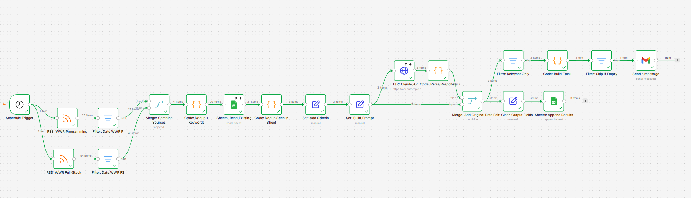
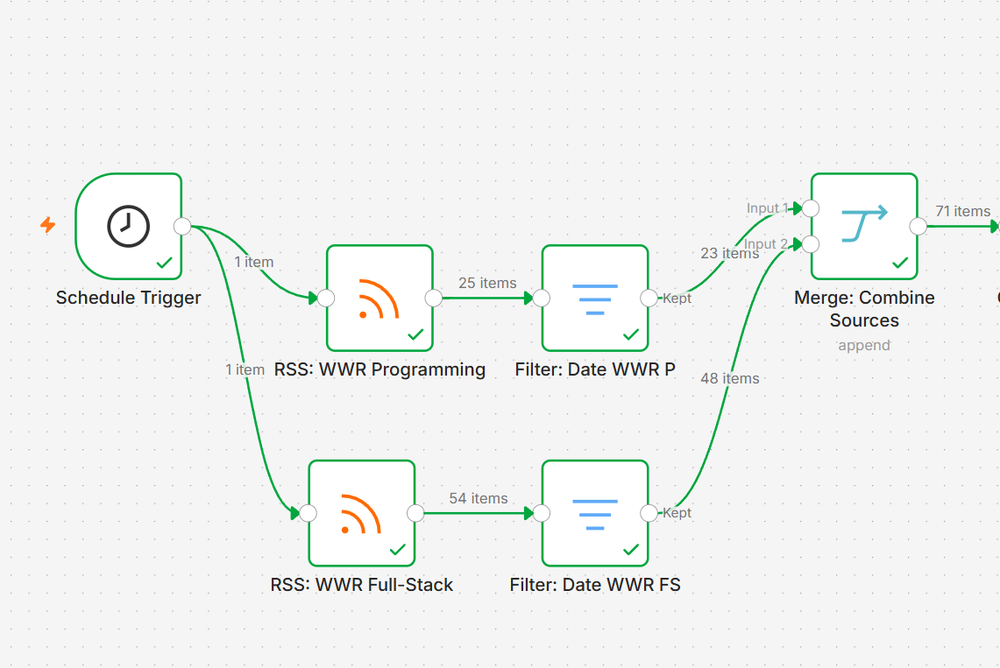
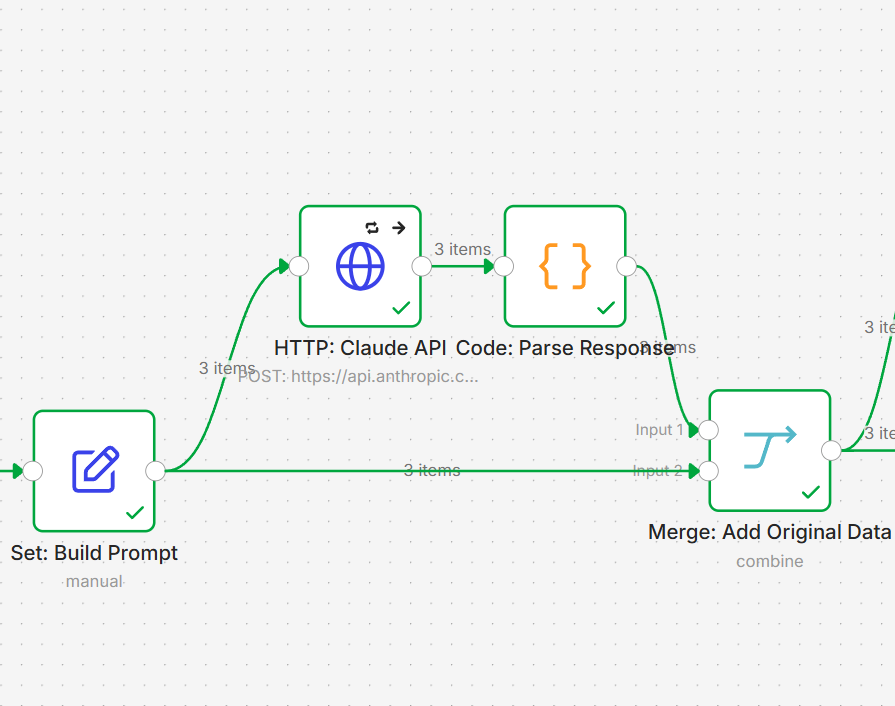
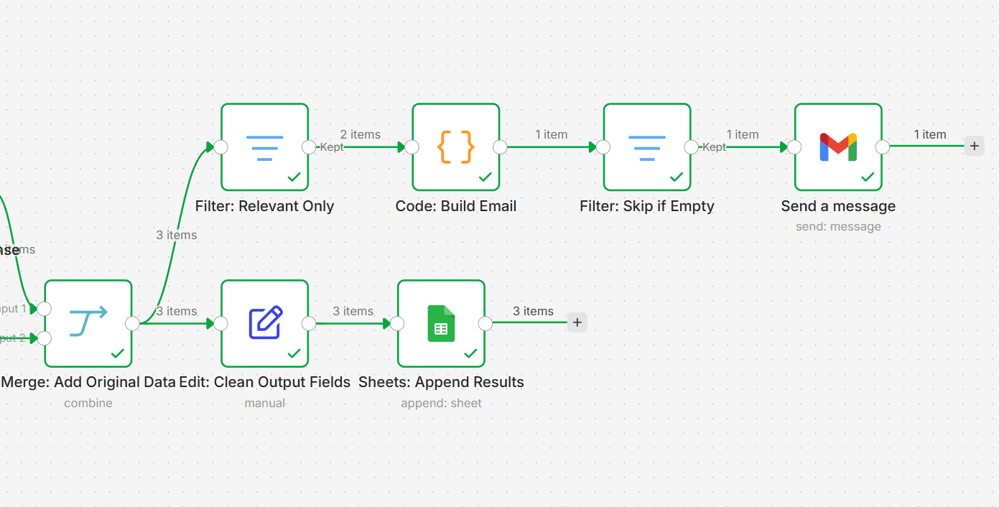

# Job Curator — Automated Job Search Pipeline

**n8n + Claude API + Google Sheets + Gmail**

Built this to stop manually scanning job boards every morning. Turned into a proper engineering problem.

A job search pipeline that runs daily, ingests listings from multiple RSS sources, classifies each one against a personal rubric using Claude API, and delivers only relevant matches to your inbox.

---

## How it works

```
Schedule Trigger (daily 9am)
↓
RSS: WWR Programming + RSS: WWR Full-Stack (parallel)
↓
Filter: Date — last 24 hours only
(extended to 30 days during testing due to low RSS activity)
↓
Merge: Combine Sources
↓
Code: Dedup + Keywords
— removes URL duplicates
— regex pre-filter: drops obvious mismatches, keeps AI/LLM signals
↓
Sheets: Read Existing (Execute Once)
Code: Dedup Seen in Sheet — skips already-classified listings
↓
Set: Add Criteria — candidate profile as injectable config
Set: Build Prompt — attaches job_id for reliable merge
↓
HTTP: Claude API (Sonnet, retry on fail, continue on fail)
Code: Parse Response — JSON parse with fallback
↓
Merge: Add Original Data (field-based, not position-based)
Edit: Clean Output Fields
↓
Sheets: Append Results — ALL listings (dedup store)
↓
Filter: Relevant Only
Code: Build Email
Filter: Skip if Empty
Gmail: Send digest
```

**Live run example:** 79 items ingested → 20 after dedup + keyword filter → 3 sent to Claude → 2 relevant delivered in one email digest.

---

## How to use this template

### 1. Credentials — connect your own
- **Anthropic Claude API** — add your API key in the HTTP: Claude API node credentials
- **Google Sheets** — connect your Google account, create a new sheet, paste the Sheet ID into Sheets: Read Existing and Sheets: Append Results nodes
- **Gmail** — connect your Google account in the Gmail: Send a message node, update the recipient address

### 2. Keyword filter — adapt to your profile
Open **Code: Dedup + Keywords** node. At the top you'll find a `config` object with three sections:

```javascript
// === USER CONFIG ===
// Edit these patterns to match your job search profile.
// Patterns are case-insensitive regex sources (without delimiters).
const config = {
  // Titles containing these words are dropped immediately.
  antiPatterns: [
    'product manager', 'product marketing', 'content marketer',
    'sales', 'account executive', 'customer success', 'recruiter',
    'devops', 'sre', 'infrastructure', 'security engineer',
    'designer', 'graphic', 'brand', 'ux researcher',
    'mobile developer', 'ios', 'android', 'qa engineer',
    'business analyst', 'data analyst', 'business development',
    'partnerships', 'community manager'
  ],
  
  // Strong signals — if found in title, pass immediately.
  // If only in description, still pass (last resort).
  strongPositive: [
    'ai', 'ml', 'llm', 'machine learning', 'prompt',
    'annotation', 'alignment', 'rlhf',
    'trust.{0,5}safety', 'content policy', 'conversation design'
  ],
  
  // Title patterns that pass independently of strongPositive
  // (e.g. seniority + role combos).
  titleAllowlist: [
    '(senior|staff|lead).{0,30}(frontend|front.end|react|full.stack|software engineer)'
  ]
};
```

**antiPatterns** — roles dropped immediately without LLM call. Add anything irrelevant to your search.

**strongPositive** — if found in title, listing passes to Claude immediately. If found only in description, still passes as last resort.

**titleAllowlist** — regex patterns that pass regardless of strongPositive. Used here for senior frontend roles as a fallback signal.

Tune aggressively — every listing dropped here saves an API call.

### 3. Candidate criteria — tell Claude who you are
Open **Set: Add Criteria** node. Update the `criteria` field with your own profile in plain language — Claude reads this as context for every classification decision.

### 4. RSS sources — replace or add your own
The template uses WeWorkRemotely Programming and Full-Stack feeds. For AI/ML roles these are low-signal — the pipeline itself made this measurable. Better sources: Greenhouse API for specific companies (Anthropic, Cohere, Scale AI), Ashby job feeds, company career pages with RSS support.

### 5. Schedule
Default is daily at 9am. Change in the **Schedule Trigger** node.

---

## Architecture decisions

**Three filter layers before Claude**

Cheap operations run before expensive ones. A regex pre-filter with configurable anti-patterns (`product manager`, `sales`, `devops`...) and positive signals (`ai`, `llm`, `rlhf`...) eliminates ~80% of noise before any LLM call. Result: ~8x reduction in API costs.

**Config/logic separation**

Keyword patterns live in a `config` object at the top of the Code node. The filtering logic below is generic — anyone can adapt the system to their own profile by changing one object, not the logic.

**Criteria as injectable parameter**

The prompt is generic. Candidate criteria are injected via a dedicated Set node. The pipeline isn't tied to one candidate — change one field and it works for a different profile.

**Field-based merge instead of position-based**

The original Merge node matched items by index. This silently breaks when Claude drops an item on parse error — titles merge with wrong scores, no error thrown. Fix: `job_id` (= URL) is passed into the prompt, Claude returns it in the JSON response, Merge matches by field. If `job_id` doesn't match, the item is lost visibly, not silently.

**Dedup store contains everything seen, not just relevant**

Early version only wrote passing listings to the sheet. Rejected listings weren't stored, so Claude re-classified them on every run — a silent money leak. Now the sheet serves as both output and dedup store. Everything gets written; relevant listings are filtered for the email digest.

**In-batch dedup**

First version checked only against the sheet. Race condition: two duplicates from different RSS sources arrive in the same run — neither is in the sheet yet, both pass, both get written. Fix: a Set node inside the Code node tracks seen URLs within the current batch before any sheet write.

---

## Problems solved along the way

**JSON serialization failure**
Building the messages array via raw JSON template string broke on the first real listing — newlines in job descriptions corrupted the JSON. Fix: Body Parameters in n8n instead of raw JSON template. n8n handles serialization; you don't concatenate user input into JSON strings.

**Haiku vs Sonnet**
Switched to Haiku to cut costs. Haiku returned `relevant: false` on everything, including the one actually relevant listing in the batch. Conclusion: Haiku handles binary classification of obvious noise but fails on multi-criteria rubrics with anti-criteria. Sonnet is necessary. Documented 2-stage architecture 
(Haiku binary triage → Sonnet detailed evaluation) as the scalable next iteration.

**Branch synchronization**
Two parallel inputs into a Code node don't guarantee both branches have executed. Error: "Node X hasn't been executed". Fix: explicit Merge node before the Code node.

**Silent criteria failure**
Several runs produced plausible-looking scores. The pipeline appeared to work, but the output was wrong. This is worse than a loud failure. Root cause: `$json.criteria` in n8n can't reference a field created in the same Set node. Fix: separate Set: Add Criteria node before Set: Build Prompt.

**Cross-join from Google Sheets**
Read Existing without Execute Once ran once per incoming item. 16 listings × 15 sheet rows = 240 items (cross-join). Fix: Execute Once. Added Always Output Data so the pipeline doesn't stop on an empty sheet during first run.

**Rate limiting**
~150 parallel requests to Anthropic hit 429. Fix: batch size 1, 5-second interval in HTTP node. Added retry on fail (3 attempts) and continue on fail so a partial API failure doesn't kill the whole run.

---

## What I learned

- **Pre-filter before expensive operations.** Measurable result: ~8x API cost reduction.
- **Dedup store must contain everything seen**, not just what passed the threshold. Otherwise rejected items get re-classified forever.
- **Never concatenate user input into JSON template strings.** Same class of bug as SQL injection.
- **Position-based merge is fragile.** Any dropout shifts indices. Field-based merge is reliable.
- **Model selection matters and must be tested on real data.** Haiku failed on edge cases exactly where it mattered — not on obvious noise.
- **Silent failures are more dangerous than loud ones.** The pipeline ran, produced output, and looked fine. The output was wrong.
- **Source quality matters.** Generic remote boards contain few AI/alignment roles. The pipeline made this measurable. Specialised sources (Greenhouse API, company career pages) are the right next step.

---

## Stack

- **n8n Cloud** — workflow orchestration
- **Anthropic Claude API** (Sonnet 4.5) — LLM classification
- **Google Sheets API** — dedup store + output log
- **Gmail API** — daily digest delivery
- **JavaScript** — Code nodes
- **RSS** — WeWorkRemotely (Programming + Full-Stack feeds)

---

## What's next

- Tool use instead of JSON.parse — guaranteed structured output without fallback logic
- 2-stage architecture: Haiku binary triage → Sonnet on positives only
- Auto-delete sheet rows older than 30 days
- Greenhouse JSON API for target companies (Anthropic, Cohere, Scale AI) — more relevant source for AI roles

---

## Workflow

### Overview


### Input & filtering


### LLM classification


### Output & delivery


Download the workflow JSON: [job-curator.json](job-curator.json)
